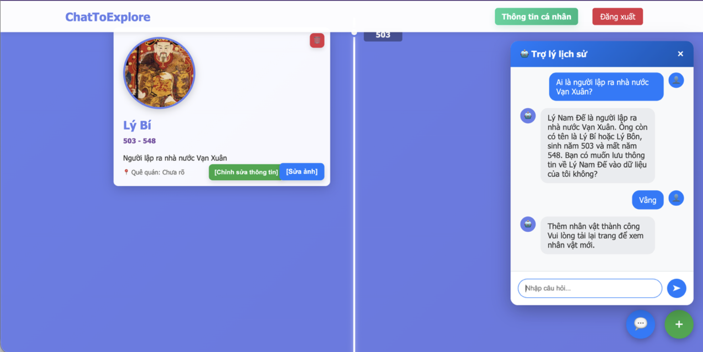

<div align="center">
  <picture>
    
  </picture>
</div>

<div align="center">
  <h3>Trò chuyện với Chatbot để biết thêm về các nhân vật lịch sử Việt Nam.</h3>
</div>

<div align="center">
  <a href="https://github.com/antialberteinstein/ChatToExplore/stargazers" target="_blank"></a>
  <a href="https://github.com/antialberteinstein/ChatToExplore/network/members" target="_blank"></a>
  
  
  
  
</div>

**ChatToExplore** là một dự án phần mềm tích hợp đa ngôn ngữ (Java, Python) cung cấp giao diện một timeline lưu trữ các anh hùng trong lịch sử Việt Nam, cho phép người dùng có thể giao tiếp với một Agent Chatbot để tìm hiểu thông tin về các anh hùng và tự động thêm các nhân vật lịch sử vào timeline. Dự án được thiết kế theo mô hình MVC và triển khai trên nền tảng Web.

---

> [!NOTE]  
> Hệ thống cần Model LLM (ví dụ: `gemma-3-4b-it-Q4_0.gguf`) để đảm bảo khả năng tương tác tự nhiên. Trọng lượng model khoảng 1-2GB (bản Q4) và yêu cầu tải thủ công.

## 🌟 Tại sao chọn ChatToExplore?

ChatToExplore hỗ trợ người dùng có một không gian trực quan và sinh động để học tập lịch sử, thông qua một Flow Agent tích hợp cùng lúc nhiều công cụ mạnh mẽ:

Sử dụng ChatToExplore để:
- **Khám phá lịch sử tự nhiên**. Trò chuyện với trợ lý AI am hiểu lịch sử, kết hợp năng lực suy luận của LLM và khả năng Web Search (dựa vào API của Google GenAI) để liên tục cập nhật kiến thức ngoài luồng sinh học.
- **Luồng xử lý thông minh (Agent Workflow)**. Ứng dụng mô hình AI chủ động (Agentic) với Few-shot prompting, giúp Bot quyết định khi nào cần tìm kiếm, khi nào cần cấu trúc văn bản thành object và tự động tạo mới Figure trên form Timeline.
- **Trực quan & Thu hút**. Quan sát các sự kiện và nhân vật lịch sử thông qua UI thiết kế dạng Timeline rõ ràng, dễ nhìn, dễ tiếp cận.
- **Kiến trúc bền vững & Dễ mở rộng**. Thiết kế dưới dạng Micro-executor độc lập phân vùng rãnh rẽ: Chat Executor (Java/Llama.cpp), Search Executor (Python) và Web Application Interface (Java Servlet/JSP). Mang lại khả năng tháo lắp linh động với mọi platform.

## 🧩 Hệ sinh thái & Công nghệ

ChatToExplore vận hành dựa trên sự kết hợp chặt chẽ giữa 3 bộ phận:

- **Chat Executor** *(viết bằng Java)* – Quản lý tiến trình trò chuyện, sử dụng thư viện Llama Java binding để mapping mô hình GGUF. Nó làm nhiệm vụ sinh (generate) text, lập luận (reasoning) và phân rẽ hướng người dùng nhằm gọi các tools tương ứng.
- **Search Executor** *(viết bằng Python)* – Được xem như cánh tay nối dài ra Internet, module xử lý NLP và trích xuất ngữ cảnh hữu ích thông qua Google GenAI trước khi trả về.
- **Web Interface** *(JSP/Servlet, MySQL, Tomcat)* – Trái tim của ứng dụng Web (MVC). Xử lý định tuyến Timeline, authentication tài khoản, đồng thời là Client giao tiếp với Chat Executor.

## 📦 Cài đặt & Khởi chạy

### 1. Chuẩn bị môi trường

- **Cài đặt Python dependencies** (Tại thư mục `src/search_executor/`):
  ```bash
  pip install -r requirements.txt
  ```
- **Cơ sở dữ liệu (MySQL)**:
  Thực thi file `database.sql` ở thư mục gốc để khởi tạo schema cho DB. Nhớ cập nhật cấu hình thông tin kết nối trong `src/main/java/config/DatabaseManager.java`.

- **Tải Model LLM**:
  Tải model [gemma-3-4b-it-Q4_0.gguf](https://huggingface.co/unsloth/gemma-3-4b-it-GGUF/blob/main/gemma-3-4b-it-Q4_0.gguf) và đưa vào thư mục `src/chat_executor/models/`. Cấu hình file `.env` chứa API Key nếu có yêu cầu.

### 2. Chạy chương trình

Do hệ thống hoạt động đa Executor, bạn cần thiết lập chạy lần lượt các quy trình sau mỗi khi start:

**Bước 1: Khởi chạy Search (Python)**
```bash
cd src/search_executor/
python main.py
```

**Bước 2: Khởi chạy Chat (Java)**
```bash
cd src/chat_executor/
./run.sh   # Trên môi trường bash (Linux, macOS, Git Bash)
# Hoặc trên Windows: mvn clean package && java -jar .\target\chat_executor\chat_executor-1.0-SNAPSHOT.jar
```

**Bước 3: Khởi chạy Web Server**
Trở lại thư mục root của dự án, sử dụng Maven Cargo Plugin nhúng Tomcat 9:
```bash
mvn initialize cargo:run
```
*(Lệnh `initialize` sẽ giúp tạo tự động các thư mục ảnh tĩnh bị thiếu)*.

## 🤝 Đóng góp
Nhat Nguyen - antialberteinstein.
